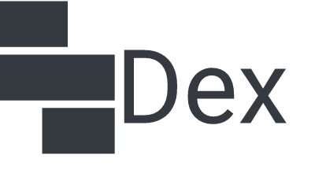
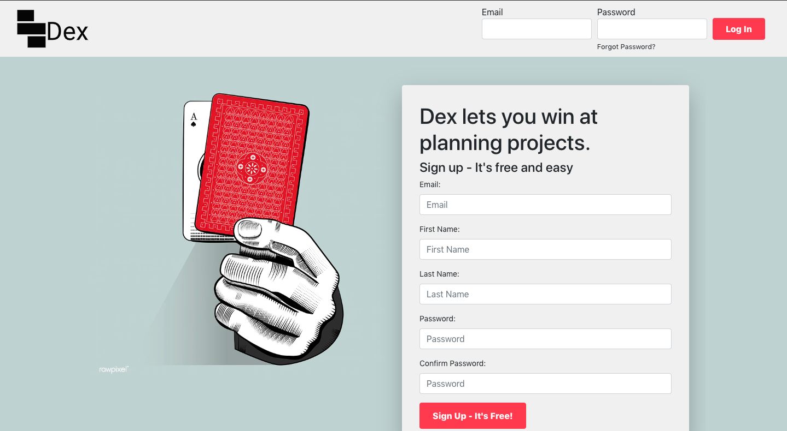
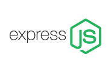
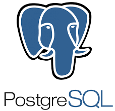
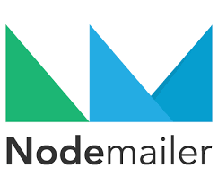

[Dex](www.winwithdex.app) is a productivity application inspired by [Trello](https://trello.com/en-US). Dex enables users to organize projects by dividing the project into phases and assigning tasks to each phase.

Users can invite other users to contribute to their projects. All of a project's team members can create phases of a task, create tasks for each phase, assign tasks to other users, and move tasks through the phases of their project.
[#Gif here]

## Tech Stack

#### Front End

  
  
  

#### Back End

  

    
    
    
    
  

#### Deployment

  

    
    
  

## Contributors

Every member of our team is a full stack engineer and worked on every part of the application. Each member also has primary authorship of at least one part of the application.

#### [Miles Zander](https://github.com/mileszander)

was the **project manager**. He built the [Edit Card modal](client/src/components/EditCardModal.js) and the [New Card modal](client/src/components/NewCardModal.js) and connected them to the back end using an http service.

#### [Brian Embry](https://github.com/baembry)

connected the front end and back end. On the front end, he built the [http service](client/services/http/http.js) and [authentication service](client/services/auth.js). On the back end, he built routes and database models for [cards](server/routes/cards.js), [decks](server/routes/decks.js), and [tables](server/routes/tables.js). He also wrote custom [authorization middleware](server/middleware/authorization.js), a [try/catch utility](server/utils/tryCatch.js), and this ReadMe.

#### [Brooke Snellings](https://github.com/brookesnellings)

oversaw UI/UX, together with Laine Doud-Eisenbart. She made tough design decisions, mocked our site with [wireframes #link](), and wrote much of our [CSS](client/public/styles.css). On the back end, she contributed to the route handlers for [cards](server/routes/cards.js).

#### [DJ Park (#github)]()

wrote authentication middleware for [registering a new user](server/middleware/auth.js) and for [authenticating a logged in user](server/middleware/jwtChecker.js) using JSON web tokens and cookies. Together with Laine Doud-Eisenbart, he created an [invitation feature](server/routes/invites.js) that sends an html-styled email inviting a user to join a project and, if applicable, to join Dex. DJ **deployed our application** with AWS and Docker.

#### [Hannah Hendrycks](https://github.com/hhendrycks?tab=repositories)

wrote the [Users route handlers](server/routes/users.js), and associated [database models](db/models/users.js), debugged authentication middleware, and deployed our database with AWS. She styled the card thumbnail component, table controls, and nav bar with React Bootstrap and CSS flexbox.

#### [Michael Bergeron](https://github.com/Michael-Bergeron)

created and designed the table view that shows all the tasks for a particular project. The table view includes several React components: [Table](client/src/components/Table.js), [Deck](client/src/components/Deck.js), [Card Thumbnail](client/src/components/CardThumbnails.js), [Controls](client/src/components/Controls.js), and [Table Settings](client/src/components/TableSettings.js). Michael also wrote the front end search and filter logic.

#### [Zona Gilreath](https://github.com/zonagilreath)

designed and implemented our [relational database](db/schemas), which includes eight tables and three join tables. He also wrote the most complex queries[1](#query) and implemented a trigger system for broadcasting live updates on the database. He [prototyped](server/socketsExperiments) a WebSocket connection for consuming these live updates and plans to implement it on a forthcoming version of Dex. Zona also optimized our production build.

#### [Laine Doude-Eisenbart](https://github.com/eisenbartl)

was part of the UI/UX team. Together with Brooke, Laine designed the UI, prototyped it with [wireframes #link](), and contributed much to the [CSS](client/public/styles.css). Laine also built the [dashboard]() view, which displays a user's projects and tasks. Together with DJ Park, Laine created an [invitation feature](server/routes/invites.js) that sends an html-styled email inviting a user to join a project and, if applicable, to join Dex.

#### [Ibrahim Jabr](https://github.com/ibrahimjabr12)

built the [nav bar](client/src/components/NavBar.js) and the view for creating a [new table](client/src/components/TableSettings.js). He also created our logo and favicon.

## Work Flow

We employed the Agile methodology and managed tasks with a ticketing system. We worked on feature git branches of a development branch, which was finally merged to a master branch. Every pull request was associated with a ticket and reviewed by another team member before being merged. We also pair programmed when appropriate.

## Challenges

#### Work Flow

We synced our github repo to [TravisCI](https://travis-ci.org/), with the goal of maintaining at least 80% test coverage on all submitted code, but extreme time pressure (a delivery time of eight days) limited our ability to write tests. As a result, bugs frequently crept into our code base. In order to address this problem within our time constraints, we increased scrutiny of submitted code and pulled approved code into a development branch, pulling into the master only when confident the development branch was bug free. Going forward, we would prefer to have complete test coverage and continuous integration.

In early days of the project, we experienced frequent merge conflicts. To address this difficulty we developed a strict git workflow whereby every feature branch must be up to date with the dev branch before pulling into the dev branch.

#### Technical

Most of our technical difficulties were due to the complexity of our data: we have eight related SQL tables and 26 api endpoints. A significant portion of our time was spent designing the database, implementing the database models, and writing route handlers. Production of the front end was slow until we had a live back end. We think SQL is the correct choice for highly relational data, but using MongoDB would have streamlined production significantly and left more time to develop the front end.

---

<a name="query">
1One of Zona's queries:

        select
          c.id,
          c.title,
          c.description,
          c.due_date,
          c.weight,
          c.impact,
          c.table_id,
          c.deck_id,
          array_agg(
            json_build_object(
              'member_id', cast(u.id as varchar),
              'member_name', u.name
            )
          ) as cards_members,
          array_agg(
            json_build_object(
                'id', l.id,
                'label_name', l.label_name,
                'color', l.color
            )
          ) as card_labels
        from
          cards c
          left outer join cards_members cm on c.id = cm.card_id
          left join users u on cm.user_id = u.id
          left outer join cards_labels cl on c.id = cl.card_id
          left join labels l on cl.label_id = l.id
        where c.id = $1
        group by c.id;

</a>
